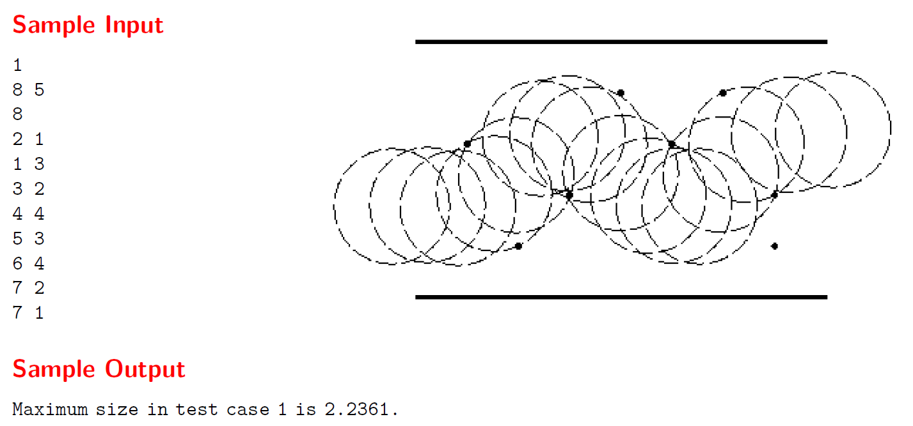

# FATMAN

## Description 
The aim of this project is to solve a training problem of the ACM-ICPC International Collegiate Programming Contest, annual competition between universities
around the world sponsored by IBM. The problem is the number 295 and is called 
[Fatman](https://uva.onlinejudge.org/index.php?option=com_onlinejudge&Itemid=8&page=show_problem&category=4&problem=231&mosmsg=Submission+received+with+ID+20346844)

It was chosen to study shortest path algorithms deeply. At the end the problem couldn't be solved but the optimum algorithm was found to solve it and it could
solve 65 of 75 problems, in average.

This is the problem number 295:

### Introduction
```
Some of us may be so fortunate to be thin enough to squeeze through the tiniest hole, others are not.
Getting from A to B in a crowded supermarket (even without a cart) can be tough and may require
sophisticated navigation: there may seem to be enough room on the one side, but then you may run
into trouble with that lady further down...

Let’s consider this in an abstract fashion: given an aisle of a certain width, with infinitely small
obstacles scattered around, just how fat can a person be and still be able to get from the left side
to the right side. Assume that seen from above a (fat) person looks like a circle and the person is
incompressible (a person with diameter d cannot go between two obstacles having distance less than
d).
```
### Input
```
The first line of input specifies the number of test cases your program has to process. The input for
each test case consists of the following lines:

* One line with the integer length L (0  L  100) and integer width W (0  W  100) of the
aisle, separated by a single space.
* One line with the number of obstacles N (0  N  100) in the aisle.
* N lines, one for each obstacle, with its integer coordinates X and Y (0  X  L, 0  Y  W)
separated by a single space.
```

### Output
```
For each test case given in the input, print a line saying ‘Maximum size in test case N is M.’,
where M is rounded to the nearest fractional part of exactly four digits. M is the maximum diameter
of a person that can get through the aisle specified for that test case. N is the current test case number,
starting at one.
```

### Example


## Algorithm
For solving the problem I decided to follow this steps:
1.  Start in the first obstacle that we find from A. Create a way with the position of that obstacle, with area the limits of the supermarket and
with diameter the maximum width that a person can have in the case that there were not obstacles.
2.  Create a set of possible ways and other of finished ways. After that we loop while the way with the maximum diameter in the finished ways set 
is not greater than the way with maximum diameter in the possible ways set, because that will mean there could be a better way.

3. For each possible way:
* From the position we are and only seeing the area in the way, we move to the next obstacle. First prioritizing the distance in the x axis and then in the y axis.
* From that obstacle we divide the way in two new ones, one from the obstacle to the highest limit in the area and other to the lowest limit. This way we discover
all the possible ways that we can follow to reach the aim, depending where we start and where we have moved.


* In case of being more obstacles up or down in the same x axis that the actual obstacle, we will create a way for each possible way between each obstacle.
* Finally we will have to adjust the diameter of that way, seeing if the actual diameter is limited by the area width or by the distance of any last obstacle.
We choose the more restrictive one.


4. We finish when the maximum diameter of the finished ways is greater than all the possible ways, this will mean we have found the optimum solution.

### Problems solved
The algorithm implemented could solve 64 of 75 problems.


And the time was:


### Possible Problem
The possible problem that has to be solved to find the perfect implementation is the change of area, I couldn't find a way to detect the change of area correctly.

## Poster


## Project Structure
```
.
├── docs  # Project Documentation
│   │
│   └── Files html, png, css...
│
├── src   # Project Source
│   │
│   ├── main.cpp
│   └── Test
│       └── test_generator.cpp
│
├── test  # Tests
│   └── data.txt
│    
└── README.md
```

## Commit Graph

```
commit c876f4808bf6a1d5df84f535bc025c9621af2e11
Author: Angel Igareta <alu0100967111@ull.edu.es>
Date:   Wed Nov 15 17:01:05 2017 +0000

    Added documentation.

commit b9078a5118a65ea4ac1400dcb657918e229c3ea7
Author: Angel Igareta <alu0100967111@ull.edu.es>
Date:   Wed Nov 15 01:18:54 2017 +0000

    Improved exception handler

commit 0fe7716461cf22793e6bfc7e725607f8335ea666
Author: Angel Igareta <alu0100967111@ull.edu.es>
Date:   Wed Nov 15 00:40:48 2017 +0000

    Removed debug messages

commit 8dc5d2b604e490cbb55a398d7720d583cc97ebfe
Author: Angel Igareta <alu0100967111@ull.edu.es>
Date:   Wed Nov 15 00:37:53 2017 +0000

    Added manual input and corrected problem with same column!

commit 39b08000d076ded1ab9301d47e74b5a0f0abc6bb
Author: Angel Igareta <alu0100967111@ull.edu.es>
Date:   Tue Nov 14 22:39:06 2017 +0000

    Finished program but with automatic input.

commit c1528af23de1431fb4860fe38d8c9f63312458ec
Author: Angel Igareta <alu0100967111@ull.edu.es>
Date:   Tue Nov 14 13:03:49 2017 +0000

    Made same process with Way for improving program.

commit 8e3ba0e51dab2363d49f94bde2fef53995868949
Author: Angel Igareta <alu0100967111@ull.edu.es>
Date:   Tue Nov 14 12:15:37 2017 +0000

    Added class Way with overload < for set

commit ddc9fc1882ede494f2c06fae04bfa1d3730b5e61
Author: Angel Igareta <alu0100967111@ull.edu.es>
Date:   Tue Nov 14 11:56:57 2017 +0000

    Result rounded

commit e8c5f79052c60a02aef42999236c7d505f206646
Author: Angel Igareta <alu0100967111@ull.edu.es>
Date:   Tue Nov 14 11:55:56 2017 +0000

    Added method to calculate correct diameter.

commit f2c67ed465d3cdd5a4b7eb9908139e2021783261
Author: Angel Igareta <alu0100967111@ull.edu.es>
Date:   Tue Nov 14 11:54:12 2017 +0000

    Added method to select area

commit bbf9ea7048e4ee58acb959aeb3fd32eec51d93f0
Author: Angel Igareta <alu0100967111@ull.edu.es>
Date:   Tue Nov 14 11:50:30 2017 +0000

    Added method to get next obstacle in an specified area.

commit af3ca015fcbb2df2565d9c428cd9d7f389f76d65
Author: Angel Igareta <alu0100967111@ull.edu.es>
Date:   Tue Nov 14 11:48:03 2017 +0000

    Added main and read_data

commit e9fd5272f56778e569fd32e3e3547e2e2674f1b5
Author: Coromoto Leon <cleon@ull.edu.es>
Date:   Tue Oct 10 12:12:38 2017 +0100

    Primera versión

commit 2b682fe3ed861b3caf24794c9a1e266659a7be90
Author: Coromoto Leon <cleon@ull.edu.es>
Date:   Tue Oct 10 12:11:33 2017 +0100

    Creando la estructura
```

## Author
   * [Ángel Igareta](https://github.com/angeligareta) **Coordinator**